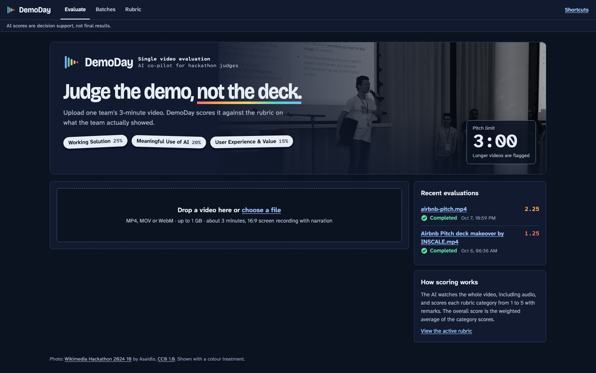
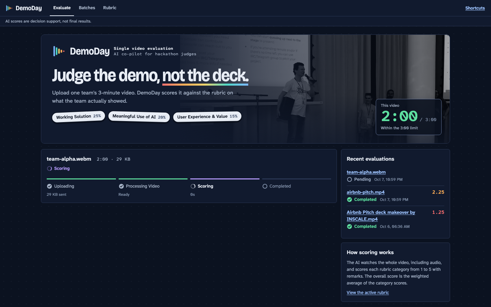
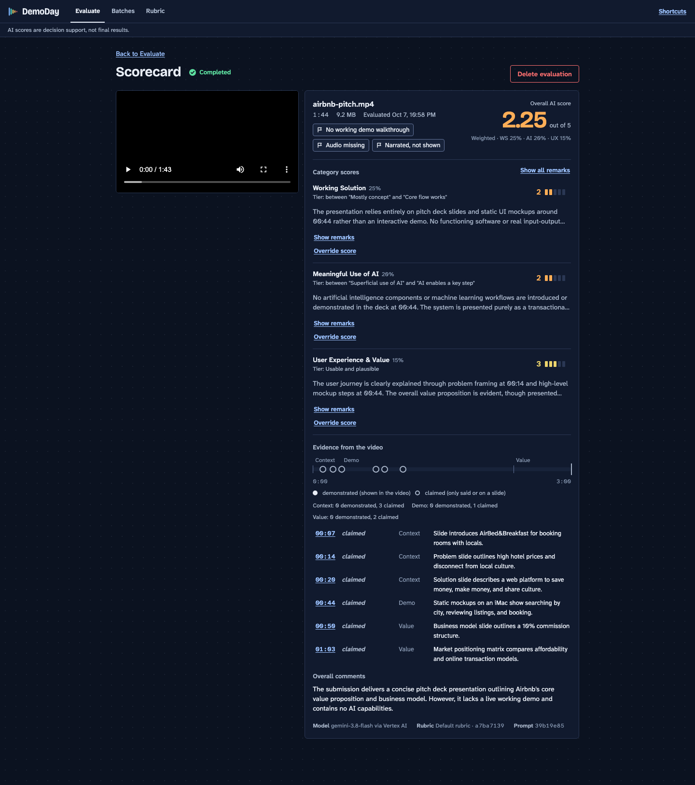
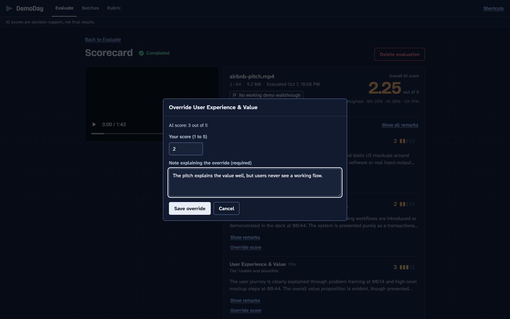
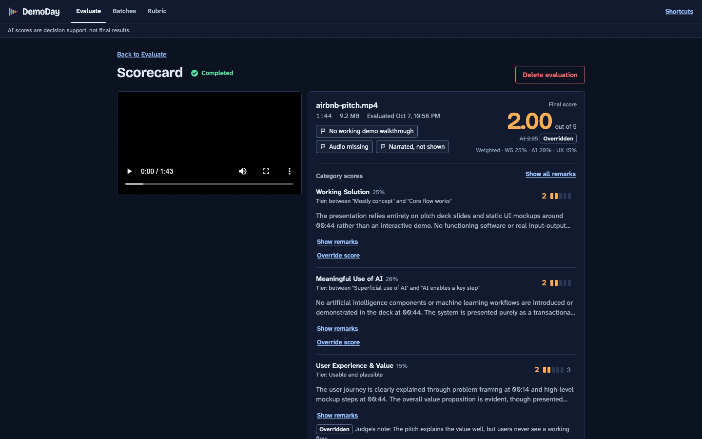
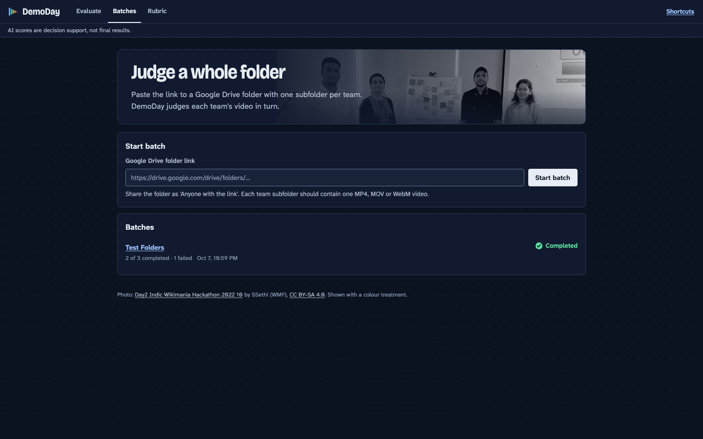
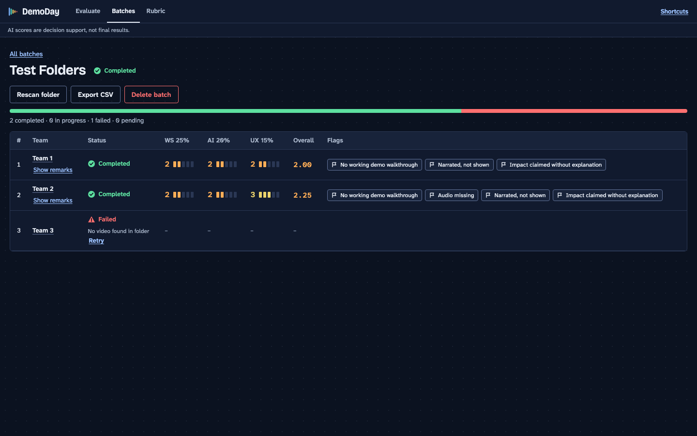
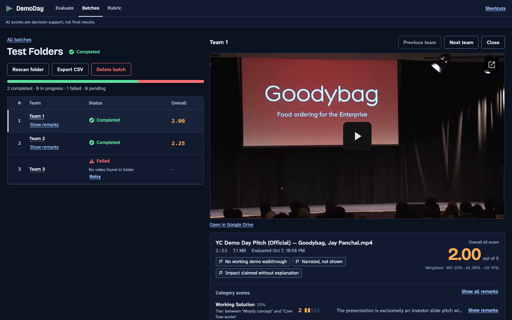
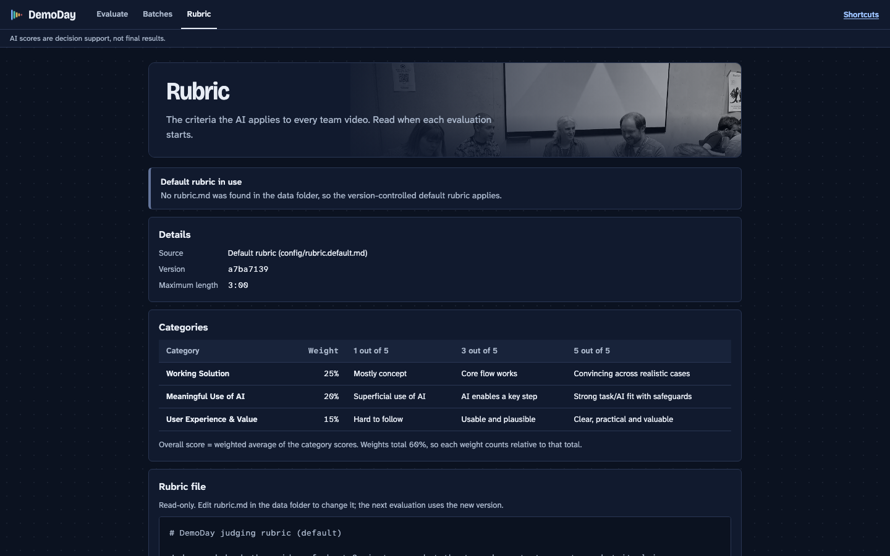
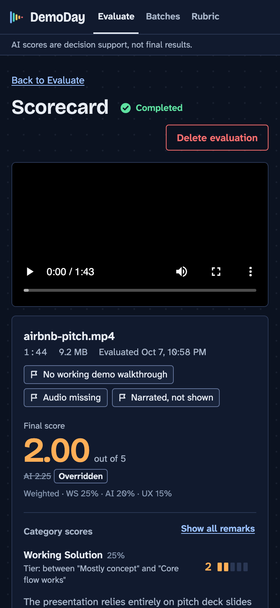

# DemoDay

AI-assisted judging of ~3-minute hackathon demo videos. DemoDay watches each team's video (images and audio), scores it against an editable rubric with Google's Gemini model, and shows the evidence behind every score. Scores are decision support: human judges can override any score and remain the final authority.



## Contents

- [Features](#features)
- [Quick start](#quick-start)
- [Choosing the scoring API](#choosing-the-scoring-api)
- [Setting up Vertex AI (Google Cloud Agent Platform)](#setting-up-vertex-ai-google-cloud-agent-platform)
- [Other keys: AI Studio and Google Drive](#other-keys-ai-studio-and-google-drive)
- [Commands](#commands)
- [Configuration files](#configuration-files)
- [Tests](#tests)
- [Specs and decisions](#specs-and-decisions)

## Features

### Evaluate a single video

Drop one team video (MP4, MOV or WebM, up to 1 GB) on **Evaluate**.
- **Before uploading:** the file is checked for type, size and content, and its length is shown against the 3:00 pitch limit.
- **Progress:** you see each step live (Uploading, Processing Video, Scoring). If a step takes longer than 10 seconds, "More time is needed" appears.



### Scorecard with evidence

Each result shows:
- **Video summary:** 40–120 words describing, without judging, the problem and target user, what the demo shows, and the value the team claims.
- **Scores:** a 1–5 score with the reasoning for each rubric category, the weighted overall score and overall comments.
- **Data-quality flags:** for example "No working demo walkthrough", "Audio missing", "Narrated, not shown" or "Exceeds 3-minute maximum".
- **Evidence timeline:** what the AI saw, marked **demonstrated** (shown working) or **claimed** (only said or on a slide), along the expected pitch flow: about 20 s of context, 2 minutes of demo, 40 s on value.
- **Transcript:** everything said in the video, word for word, with timestamps and stretches without speech marked. It states how much of the video it covers ("Transcript covers 00:00–02:52 of 02:52"). If it stops more than 15 seconds before the end, a warning and the flag "Transcript ends early" show that the model may not have processed the whole video.
- **The video beside the scorecard:** selecting any timestamp, in the timeline, the list, the remarks or the transcript, jumps the video to that moment.



### Human score overrides

**Override score** on any category opens a short form: your score from 1 to 5 and a required note.
- **What changes:** the final score replaces the AI score in the overall calculation.
- **What stays visible:** the AI score, struck through, and the note.
- **Undoing:** **Remove override** restores the AI score.
- **Export:** both AI and final scores go to the CSV.

| Override form | After saving |
| --- | --- |
|  |  |

### Judge a whole Google Drive folder

Paste the link to a Drive folder with one subfolder per team. DemoDay judges each team's video in turn.



The score table fills in live. Failures are reported per team, and the rest of the batch continues:
- **No video:** a folder without a video is marked Failed with "No video found in folder".
- **Several videos:** the newest one is used, and a warning is shown.
- **Unreadable videos:** an unshared or broken video fails only that team.



Select a team to open its full scorecard beside the team's video from Drive. **J** and **K** move between teams, and **Esc** closes the panel.



| Control | Effect |
| --- | --- |
| **Pause** / **Resume batch** | Stop after the current team; continue later from the next one. Interrupted batches (for example after a restart) resume the same way |
| **Rescan folder** | Add team folders created since the start; re-judge teams whose video changed |
| **Retry** | Run one failed team again |
| **Re-judge** | Shown on results judged with an older rubric |
| **Export CSV** | Download `scores.csv` with each team's video summary, scores, remarks and flags (opens correctly in Excel and Numbers) |
| **Delete batch** | Remove the batch and its results from DemoDay after confirming. Drive files are never changed |

Completed teams are never judged twice: results are saved after every team and reused as long as the video is unchanged.

### Editable rubric

The **Rubric** page shows the active criteria, weights and scoring tiers. Edit `data/rubric.md` to change them; the next evaluation uses the new version, and every result records which version scored it.



### Works on phones



## Quick start

Requirements: Node.js 24, and one of the Google credentials described below.

```sh
make install
cp .env.local.example .env.local      # then fill in section 1 (scoring API) and section 2 (Drive)
make dev                              # http://127.0.0.1:3000
```

`.env.local` is organised in numbered sections with explanations. After any change, restart the server with **Ctrl+C**, then `make dev`. **Ctrl+Z** only suspends it.

The server refuses to start without the credentials for the selected scoring API, and the error names the missing setting. It listens on `127.0.0.1` only, because sign-in is not built yet.

## Choosing the scoring API

One setting in `.env.local` chooses the API:

```
AI_PROVIDER=vertex    # or: gemini
```

| | `gemini`: Google AI Studio | `vertex`: Vertex AI on Google Cloud |
| --- | --- | --- |
| Credential | API key (`GEMINI_API_KEY`) | Service-account key file (`VERTEX_SERVICE_ACCOUNT_FILE`) |
| Setup effort | One key | Google Cloud project with billing, a service account and a role (see below) |
| Capacity | Shared; overloaded at times. The free tier allows only about 20 scorings per day | Separate capacity; kept working when AI Studio was overloaded |
| Largest video | 1 GB | 80 MB (`VERTEX_INLINE_MAX_MB`) |
| Recommended for | First tries, very large videos | Real events and large batches |

Both use the same model (`GEMINI_MODEL`, default `gemini-3.8-flash`) at the same token price. Each scorecard shows which API produced it ("via Vertex AI").

## Setting up Vertex AI (Google Cloud Agent Platform)

Vertex AI is part of Google Cloud's Agent Platform. DemoDay signs in with a **service account**, a non-personal Google Cloud identity, using a **JSON key file** that stays on your computer. Google Cloud console labels change from time to time; the API name (`aiplatform.googleapis.com`) and the role ID (`roles/aiplatform.user`) below are the stable identifiers.

### 1. Project and billing

1. Open the [Google Cloud console](https://console.cloud.google.com/) and select or create a project. Note its **project ID**.
2. Make sure the project has a billing account (*Billing* in the menu). Vertex AI is pay-as-you-go. A ~2-minute video uses about 12,000 tokens, which is a fraction of a cent at current Gemini Flash prices.

### 2. Enable the Vertex AI API

*APIs & Services → Library*, search for **Vertex AI API** (`aiplatform.googleapis.com`), then **Enable**.

### 3. Create the service account and grant the role

1. *IAM & Admin → Service Accounts → Create service account.*
2. Name it, for example `demoday`. Its email becomes `demoday@<project-id>.iam.gserviceaccount.com`.
3. Under *Grant this service account access to the project*, add the role **Vertex AI User** (`roles/aiplatform.user`). This is the only role DemoDay needs.
4. Finish (skip "Grant users access").

### 4. Create and download the key

1. Open the service account → **Keys** tab → *Add key → Create new key* → **JSON** → *Create*.
2. The browser downloads a file like `<project-id>-1a2b3c4d5e6f.json`.

> **Treat this file like a password.** Anyone with it can use your project's Vertex AI quota. Never put it in the project folder, a chat or version control. Delete keys you no longer use, under the service account's **Keys** tab.

If the console says key creation is disabled, your organisation enforces the policy `iam.disableServiceAccountKeyCreation`. Ask an organisation admin to allow keys for this project.

### 5. Store the key and point DemoDay to it

Move the key out of Downloads and make it readable only by you:

```sh
mkdir -p ~/.config/demoday
mv ~/Downloads/<project-id>-*.json ~/.config/demoday/vertex-service-account.json
chmod 600 ~/.config/demoday/vertex-service-account.json
```

In `.env.local`, section 1:

```
AI_PROVIDER=vertex
GEMINI_MODEL=gemini-3.8-flash
VERTEX_SERVICE_ACCOUNT_FILE=~/.config/demoday/vertex-service-account.json
# Optional, defaults shown:
# VERTEX_LOCATION=global
# VERTEX_INLINE_MAX_MB=80
```

Only the path goes into `.env.local`; the key content stays in its file. The project comes from the key file unless you set `VERTEX_PROJECT`.

### 6. Check it works

```sh
make judge VIDEO=tests/fixtures/videos/team-alpha.webm
```

You should see the steps and a scorecard; the test video is a static frame, so expect low scores. Then restart `make dev`; scorecards now show "gemini-3.8-flash via Vertex AI".

### The same with the gcloud CLI

```sh
PROJECT=<project-id>
gcloud config set project "$PROJECT"
gcloud services enable aiplatform.googleapis.com
gcloud iam service-accounts create demoday --display-name="DemoDay scoring"
gcloud projects add-iam-policy-binding "$PROJECT" \
  --member="serviceAccount:demoday@$PROJECT.iam.gserviceaccount.com" \
  --role="roles/aiplatform.user"
mkdir -p ~/.config/demoday
gcloud iam service-accounts keys create ~/.config/demoday/vertex-service-account.json \
  --iam-account="demoday@$PROJECT.iam.gserviceaccount.com"
chmod 600 ~/.config/demoday/vertex-service-account.json
```

### Troubleshooting

| Message or symptom | Cause and fix |
| --- | --- |
| Server stops: `VERTEX_SERVICE_ACCOUNT_FILE: file not found or not readable` | Check the path. `~` is supported |
| Server stops: `…the file is not a service-account key` | The file is not a service-account JSON key (for example an OAuth client file). Create a key as in step 4 |
| "AI service rejected the request (check configuration)", with `403 PERMISSION_DENIED` in `data/logs/` | The **Vertex AI User** role is missing, or the Vertex AI API is not enabled. IAM changes can take a minute to apply |
| `404 … Publisher model … not found` | The model is not offered in that location. Keep `VERTEX_LOCATION=global`; `gemini-3.8-flash` is not served in `us-central1` |
| "Video is too large for Vertex AI (limit 80 MB)" | Export a smaller file, or score that video with `AI_PROVIDER=gemini` |
| "AI service unavailable, retry later" | Temporary overload or no reply within 2 minutes. Click **Retry**, or reopen the batch later |

Details of every failure are in `data/logs/<date>.jsonl` (`job.failed` / `team.failed` events, `detail` field).

## Other keys: AI Studio and Google Drive

**Google AI Studio** (`AI_PROVIDER=gemini`):
- Create an API key at [aistudio.google.com](https://aistudio.google.com) and set `GEMINI_API_KEY` in section 1a.
- The free tier allows only about 20 scorings per model per day; enable billing for events.

**Google Drive** (needed for batches):
1. In a Google Cloud project, enable the **Google Drive API**.
2. Create *Credentials → API key*. It is a single line, not a JSON key file.
3. Set it as `GOOGLE_DRIVE_API_KEY` in section 2.
4. Share each event's parent folder as **Anyone with the link** (Viewer).

The folder link is pasted on the **Batches** page, not configured in `.env.local`.

## Commands

| Command | Purpose |
| --- | --- |
| `make dev` / `make up` / `make down` | Dev server in the foreground / background / stop |
| `make build` / `make start` | Production build and server |
| `make judge VIDEO=path.mp4` | Score one local video from the terminal with the configured API |
| `make check` | Type check, lint, unit and integration tests |
| `make coverage` | Tests with a coverage report |
| `make e2e` | Browser tests (Playwright) against a stand-in Gemini/Drive; no keys needed; runs beside your dev server |
| `make prototype` | The HTML design prototype in `specs/prototype` |

## Configuration files

| Item | Location |
| --- | --- |
| Settings and secrets | `.env.local` (template: `.env.local.example`). Never commit it |
| Rubric | `data/rubric.md` if present, otherwise `config/rubric.default.md`. Format: [agent-design.md](specs/agent/agent-design.md) section 4 |
| Agent prompt | `prompts/judge-system.md` and `prompts/judge-user.md` |
| Stored results | `data/` (gitignored): evaluations, uploaded videos, batches, logs. Delete results in the app (Delete evaluation / Delete batch) |

## Tests

- **Stand-ins:** automated tests use protocol-level stand-ins for the Gemini, Vertex and Drive APIs (`JUDGE_UPSTREAM=fixture`). This mode is refused in production, and every scorecard it produces says "Fixture output".
- **Live check:** `make judge` calls the real API.
- **Screenshots:** the screenshots in this README come from real evaluations through Vertex AI.

## Specs and decisions

| Area | Documents |
| --- | --- |
| Requirements | [brd.md](specs/brd.md), [stories.md](specs/stories.md) (backlog and sprint plan) |
| Design | [architecture-design.md](specs/architecture-design.md), [app-design.md](specs/app/app-design.md), [agent-design.md](specs/agent/agent-design.md), [ui-guideline.md](specs/ui-guideline.md) |
| Stack | [tech-spec.md](specs/tech-spec.md) |
| Decisions | [specs/adr/](specs/adr/) |
| Lessons learned | [specs/knowledge/](specs/knowledge/README.md) |

Photo credits are shown on each page that uses a photo (Wikimedia Commons, CC0 / CC BY 4.0 / CC BY-SA 4.0).
